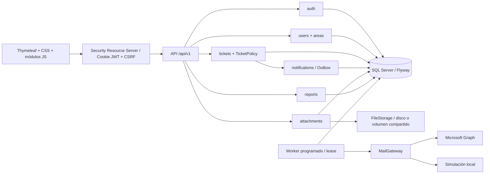
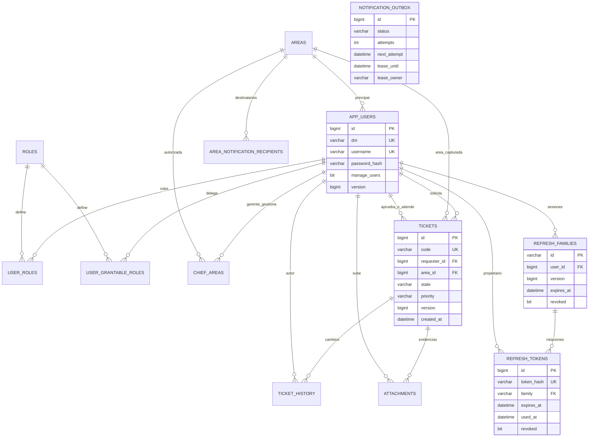

# Arquitectura y modelo de datos

Una aplicación MVC y una base SQL Server. Los módulos se organizan por funcionalidad; controladores API pequeños delegan en servicios transaccionales. Los records representan DTOs, no entidades serializadas. TicketPolicy concentra visibilidad y transiciones. No se incorporaron Redis, Kafka ni infraestructura distribuida adicional: SQL Server coordina códigos, renovación y outbox.

El outbox almacena un mensaje independiente por destinatario; no necesita una relación con tickets para conservar el trabajo pendiente tras modificaciones de datos. Los buckets del login contienen hashes SHA-256 de DNI/IP y una ventana, no sus valores originales. Las entidades mutables solo se usan dentro del backend; el acceso a asociaciones utiliza métodos para permitir inicialización de proxies JPA.

Las consultas paginadas utilizan EntityGraph para relaciones de ticket, solicitante, área, aprobador y técnico. Las distribuciones del dashboard se agregan en SQL. El promedio utiliza proyecciones de fechas e identificadores por lotes de hasta 500, sin cargar entidades completas. Los reportes recorren lotes de 500 con cursor por id y límite superior inicial, sin repetir COUNT del resultado total; SXSSF mantiene 100 filas en memoria y abre hojas adicionales al alcanzar el límite de Excel. No hay snapshot transaccional global de la exportación: cambios durante el recorrido pueden verse en lotes posteriores.

La secuencia `ticket_code_seq` asigna correlativos globales independientes de identity. El formato toma el mes en Lima y admite más de cuatro dígitos; puede haber saltos por rollback. `@Version` protege transiciones. La carga de evidencia fuerza incremento optimista de versión para impedir que una aprobación concurrente y la carga se confirmen sobre la misma versión.

Las escrituras de archivos no pueden incluirse en una transacción SQL: un rollback borra el archivo mediante synchronization; una caída del proceso puede dejar un archivo huérfano. Reconciliar periódicamente storage_key contra el almacenamiento, preservando archivos recientes que aún puedan estar en transacción. No eliminar archivos automáticamente durante una migración.

Para varias instancias: claves RSA compartidas desde un gestor de secretos, misma base, sincronización de reloj, mismo almacenamiento persistente de evidencias y un proxy HTTPS de confianza. FileStorage permite un adaptador de objetos futuro; la implementación entregada usa un volumen local/compartido. No usar discos efímeros independientes por réplica. Los leases de correo se coordinan en SQL; no se requiere afinidad de sesiones.

El proceso JVM establece UTC desde el arranque para que los Timestamp de JDBC no dependan de la zona del servidor; Hibernate usa también UTC explícitamente. La presentación conserva America/Lima. Las exportaciones tienen un executor limitado a cuatro hilos y ocho tareas en espera, con timeout configurable app.reports.timeout-ms (cinco minutos por defecto); la saturación devuelve 503. Dimensionar disco temporal y memoria según la carga de SXSSF.
