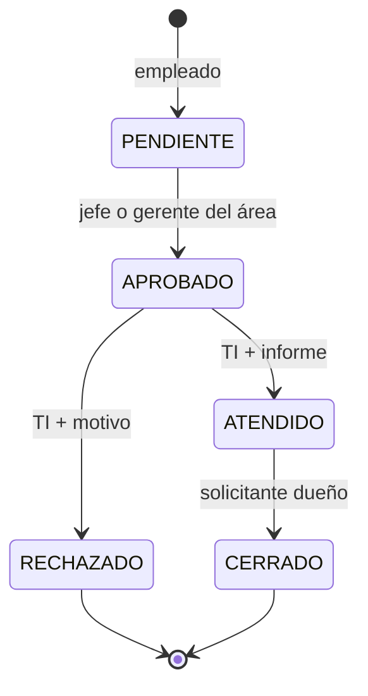

# Permisos y autenticación

Los únicos roles son EMPLEADO, JEFE, GERENTE y TI. Los roles se suman. EMPLEADO reemplaza a SOLICITANTE; el término solicitante sigue identificando a quien creó un ticket. El cargo es descriptivo y no concede permisos.

JEFE consulta y aprueba tickets del área principal de su usuario (app_users.area_id). GERENTE consulta y aprueba tickets de las áreas de gestión asignadas en chief_areas, aunque no coincidan con su área principal. Se conserva ese nombre de tabla para evitar una modificación innecesaria de relaciones existentes. Tener GERENTE no autoriza automáticamente su área principal si no está asignada. Con ambos roles se suman los alcances. TI conserva visibilidad global, pero no puede aprobar salvo que también tenga JEFE o GERENTE con el alcance correspondiente.

La diferencia JEFE/GERENTE se implementó como supuesto comunicado durante el cambio: Jefe de un área principal y Gerente de varias áreas autorizadas. Los usuarios siguen pudiendo tener varios roles.

| Operación | EMPLEADO | JEFE | GERENTE | TI |
|---|---|---|---|---|
| Crear ticket | Sí | Con EMPLEADO | Con EMPLEADO | Con EMPLEADO |
| Listar, detalle, historial y descargar evidencias | Propios | Propios y área principal | Propios y áreas asignadas | Todos |
| Dashboard, reportes y Excel | Mismo alcance | Mismo alcance | Mismo alcance | Mismo alcance |
| Adjuntar evidencia | Dueño, PENDIENTE | Dueño, PENDIENTE | Dueño, PENDIENTE | Dueño, PENDIENTE |
| Aprobar | No | Área principal, PENDIENTE | Área asignada, PENDIENTE | Solo con JEFE o GERENTE autorizado |
| Atender | No | No | No | APROBADO; informe obligatorio |
| Rechazar | No | No | No | APROBADO; motivo obligatorio |
| Cerrar | Dueño, ATENDIDO | Dueño, ATENDIDO | Dueño, ATENDIDO | Dueño, ATENDIDO |
| Registrar usuarios | No | No | No | Requiere manageUsers y roles delegables explícitos |

Un Gerente necesita al menos un área de gestión. No se aceptan áreas de gestión adicionales al registrar un Jefe sin rol GERENTE: su alcance depende de su área principal. El frontend oculta esas opciones, pero las reglas se comprueban en el backend.

No hay autorregistro público. user_grantable_roles define los roles que el operador autoriza a delegar; el creador debe tener TI y manageUsers, y todos los roles pedidos deben estar en esa relación. Registrar un usuario no delega manageUsers ni la capacidad de otorgar roles. Delegar GERENTE incluye asignación de áreas y debe reservarse a administradores autorizados para ese alcance organizativo.

## Migración de roles existentes

V2 cambia SOLICITANTE por EMPLEADO sin borrar usuarios, tickets, contraseñas ni relaciones. Agrega GERENTE. Los jefes que ya gestionaban un área distinta de su área principal pasan a GERENTE conservando sus áreas; el resto mantiene JEFE y pasa a gestionar su área principal. La delegación anterior de JEFE también habilita delegar GERENTE, porque antes incluía gestión de varias áreas. Los permisos de administración no se conceden a nuevos usuarios por esta migración.

V1 no se modifica: una base nueva aplica V1 y V2; una existente aplica únicamente V2. Recompilar o reconstruir la imagen no elimina datos. Los tokens emitidos conservan sus claims hasta expirar; las operaciones de negocio y el endpoint me recuperan roles actuales de la base. Volver a iniciar sesión después de actualizar evita usar información de roles anterior en otras integraciones.

## Tokens y CSRF

JWT RS256 con algoritmo permitido explícitamente, clave privada PEM PKCS#8 y pública PEM X.509. Nimbus y Spring Security firman y validan; se exige firma, exp, issuer y audience, sin tolerancia posterior a exp. Los tiempos son configurables. Las claims de roles se usan para métricas; las operaciones de negocio recuperan permisos actuales de la base.

ACCESS HttpOnly, Path `/`, contiene el access token. REFRESH HttpOnly, Path `/api/v1/auth`, contiene un token opaco de 256 bits. Ambas cookies son SameSite=Lax y Secure en prod. No aparecen en JSON, localStorage, sessionStorage ni logs. STATELESS, NullSecurityContextRepository y NullRequestCache evitan autenticación mediante HttpSession/JSESSIONID.

GET `/api/v1/auth/csrf` entrega el token y el nombre de cabecera y crea XSRF-TOKEN. Todo POST, incluidos login/refresh/logout, necesita esa cookie y X-XSRF-TOKEN. Formularios tradicionales pueden enviar `_csrf`; los entregados usan Fetch con la cabecera. Solo la cookie CSRF es legible por JavaScript para integrar Swagger.

Resource Server agrega normalmente una excepción CSRF para bearer tokens. El postprocessor de CsrfFilter restaura DEFAULT_CSRF_MATCHER para proteger todas las operaciones no seguras aunque el JWT provenga de una cookie. No se desactiva CSRF.

La renovación consulta únicamente el identificador de familia, bloquea su registro compartido y después bloquea el refresh token. Este orden serializa rotaciones, logout y revocaciones entre instancias sin cargar un token obsoleto antes de esperar el bloqueo. Marca used_at, genera otro token de la misma familia y almacena solo SHA-256. Reutilizar un token usado o revocado revoca la familia y todos sus tokens y devuelve 401; esa revocación se confirma aunque se rechace la petición. Los hashes consumidos se conservan mientras exista un token no vencido de la familia. Logout revoca la familia presentada y elimina ambas cookies; las sesiones independientes mantienen otras familias.

JavaScript usa una sola promesa de renovación por página, coordina pestañas mediante Web Locks cuando está disponible y reintenta una petición fallida por 401 una sola vez. Sin Web Locks dos pestañas pueden provocar detección de reutilización y requerir login. `/auth/recover` permite renovar ante navegación directa y valida un destino del mismo origen.

Logout no invalida criptográficamente access tokens emitidos: mantienen validez hasta expirar. Desactivar usuarios o cambiar permisos afecta casos de uso que leen la base. Las claims de métricas pueden conservar roles hasta 15 minutos. No hay denylist distribuida de JWT.

## Contraseñas, archivos y logs

BCrypt coste 12. Nuevas contraseñas: mínimo 12 caracteres y máximo 72 bytes UTF-8. Login usa un mensaje uniforme y compara con un hash ficticio si no existe el DNI. SQL coordina límites de 10 intentos por DNI y por IP en 15 minutos usando hashes de buckets. X-Forwarded-For no se interpreta por defecto; se requieren proxies confiables antes de cambiarlo.

Nuevas evidencias: PDF, PNG, JPG/JPEG y TXT UTF-8 hasta 10 MB. Imágenes con firma y decodificación, hasta 25 millones de píxeles. PDF con firma, final y lectura PDFBox, no cifrado y hasta 500 páginas. TXT sin contenido binario. Estas validaciones no sustituyen un análisis antimalware organizativo. Los archivos históricos mayores de 10 MB pueden conservar metadatos al migrar.

UUID interno y CREATE_NEW impiden traversal y sobrescritura. La autorización precede a la lectura. Descargas attachment, application/octet-stream, nosniff, CSP sandbox y no-store. Metadatos: nombre saneado, tamaño, SHA-256, actor y fecha. El directorio de evidencias no se publica como contenido estático.

La ruta `GET /api/v1/tickets/{id}/attachments/{attachmentId}/view` reutiliza la autorización de descarga y verifica la relación entre evidencia y ticket. Solo sirve inline image/png, image/jpeg, application/pdf o text/plain; el texto usa UTF-8. Metadatos de otros formatos devuelven 415 y pueden descargarse. Todas las visualizaciones tienen no-store, nosniff y CSP sin scripts web ni embedding. Imágenes y TXT tienen además sandbox; PDF permite objetos del mismo origen para el visor nativo del navegador. El botón Ver abre una pestaña sin opener y realiza HEAD mediante el cliente autenticado, con renovación y un solo reintento, antes de navegar a la evidencia.

Logs ECS con correlationId aleatorio y X-Correlation-ID. Errores de correo guardan tipo de excepción, no cuerpos ni secretos. No habilitar logs de cuerpos HTTP, parámetros SQL ni DEBUG de autenticación en producción. Health no expone detalles; Prometheus exige TI; otros endpoints Actuator se deniegan.
